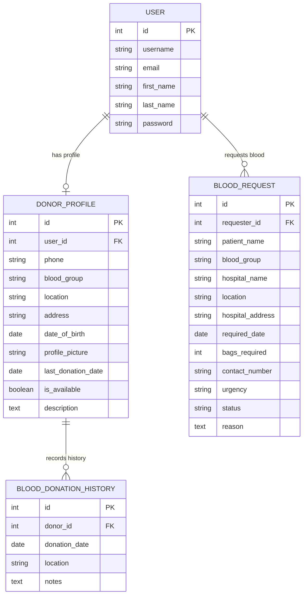

# 🩸 BloodLink — Blood Donate & Request Management System

<p align="center">
  
  
  
  
  
  
  
</p>

A modern, full-stack, production-grade Blood Donate & Request Management System built with **Django**, **Vanilla CSS3**, and **JavaScript**, connecting voluntary blood donors with patients, families, and healthcare facilities across Bangladesh in real time.

> **"Find a donor. Save a life."**

---

## 📑 Table of Contents
- [Project Overview](#project-overview)
- [Technology Stack](#technology-stack)
- [Key Features](#key-features)
- [Blood Compatibility Matrix Engine](#blood-compatibility-matrix-engine)
- [Database Schema & Data Models](#database-schema--data-models)
- [Sample Database & Demo Credentials](#sample-database--demo-credentials)
- [Installation & Local Setup Guide](#installation-setup-guide)
- [Automated Testing](#automated-testing)
- [Project Architecture & Directory Structure](#project-architecture)

---

<a id="project-overview"></a>
## 🔍 Project Overview

In critical medical emergencies—such as road traffic accidents, complex surgeries, postpartum hemorrhages, thalassemia transfusions, or dengue complications—seconds count. Finding a compatible blood donor is often a race against time.

**BloodLink** solves this challenge by eliminating intermediaries and providing an instant, transparent platform where:
1. **Patients & Relatives** can post emergency blood requests with hospital information, urgency levels, required dates, and direct contact numbers.
2. **Voluntary Donors** can register their blood group, location, and real-time availability status, while tracking their 90-day biological donation cooldown period.
3. **Smart Matching Algorithm** automatically cross-matches compatible donor groups for each patient request, prioritizing proximity by city and active availability.

---

<a id="technology-stack"></a>
## 🛠️ Technology Stack

| Layer / Category | Technology / Badge | Details & Purpose |
| :--- | :--- | :--- |
| **Programming Language** |  | **Python 3.12.10** — Robust, secure backend core |
| **Backend Framework** |  | **Django 6.1.1** — High-level MTV web framework (ORM, ModelForms, Auth, Class-Based & Function Views) |
| **Database Engine** |  | **SQLite 3** — Relational database storing user profiles, donor credentials, and blood requests |
| **Image & Media Engine** |  | **Pillow 12.3.0** — Image processing for donor profile avatars |
| **Authentication Engine** |  | **Custom EmailBackend** — Authenticate via **Email Address & Password** on both user login & Django Admin |
| **Frontend Architecture** |  | **Semantic HTML5** — Accessible markup, proper heading hierarchy, ARIA labels, and SEO meta tags |
| **Styling & Design System** |  | **Custom Vanilla CSS3** — Tailored design system, CSS variables, glassmorphism cards, micro-animations & responsive layout |
| **Scripting & Interactivity** |  | **Vanilla JavaScript (ES6+)** — Interactive password show/hide toggles, mobile navigation drawer, and toast alerts |
| **Typography** |  | **Google Fonts** — *Outfit* for brand headlines & *Plus Jakarta Sans* for clean body typography |
| **Automated Testing & QA** |  | **Django TestCase** — 23 unit tests covering models, forms, views, auth, filters, and cross-matching |

---

<a id="key-features"></a>
## ✨ Key Features

### 1. User Authentication & Profile Management
- **Email-Based Authentication**: Users and Administrators log in using their **Email Address and Password** across both the frontend (`/login/`) and the Django Admin panel (`/admin/`).
- **Custom Registration**: Seamless onboarding collecting first name, last name, email, phone number, username, password, blood group, location, date of birth, and optional profile picture.
- **Direct Donor Enrollment**: Checkbox option to automatically enroll as an active voluntary donor upon sign-up.

### 2. Voluntary Donor Management & Biological Cooldown Tracker
- **Comprehensive Profile**: Blood group badge, verified contact number, district/city, detailed address, avatar, and donor biography.
- **90-Day Donation Cooldown Calculator**: Automatically calculates days elapsed since the last donation. Displays green *"Eligible to Donate"* or amber *"In Recovery Cooldown (X days remaining)"*.
- **One-Click Availability Toggle**: Donors can instantly switch their availability status (`Available` / `Unavailable`) from their profile or dashboard.
- **Profile Self-Management**: Authenticated donors can update their contact details, address, donation history, or delete their profile.

### 3. Emergency Blood Request Lifecycle (CRUD)
- **Urgent Request Creation**: Post urgent requests with patient name, required blood group, hospital name, location, required date, bags count, contact hotline, and medical reason.
- **Urgency Classification**: Categorized as `Critical (Emergency)`, `Urgent`, or `Normal Priority` with distinct visual badges.
- **Status Pipeline**: Lifecycle tracking from `Pending` ➔ `Fulfilled` / `Cancelled`.
- **Direct Contact Button**: One-click `tel:` link on emergency request cards allowing donors to immediately call the requester.
- **Owner Permissions**: Only the user who posted a blood request can edit, mark as fulfilled, or delete it.

### 4. Intelligent Cross-Matching Algorithm
- Automatically calculates compatible donor blood groups for any patient requirement.
- Renders matching available donor cards on the request details page, sorting donors by same-district proximity and availability.

### 5. Multi-Parameter Search & Filtering System
- **Hero Quick Search**: Instantly query available donors by blood group and city from the homepage.
- **Donor Directory Search**: Filter donors by Blood Group dropdown, District / City text search, and Availability status (`All`, `Available Only`, `Unavailable Only`).
- **Requests Directory Search**: Filter blood requests by Blood Group, Hospital / Location search, and Status (`All`, `Pending`, `Fulfilled`, `Cancelled`).
- **Clean Pagination**: 9 items per page for donor cards and 8 items per page for request cards.

### 6. User Dashboard & Request Tracking
- **Centralized Command Center**: Displays personal donation statistics (Total Requests Posted, Active Emergency Requests, Fulfilled Requests).
- **Manage My Requests**: Dedicated management table with status badges and quick edit/delete actions.
- **Quick Links**: Fast access to post emergency blood requests or update donor profile settings.

### 7. Modern Bespoke UI & Aesthetics
- **Color Palette**: Deep primary crimson (`#E11D48`), warm slate neutrals, glassmorphic headers, and status-tailored badges.
- **Mobile Responsive Drawer**: Off-canvas hamburger menu providing smooth navigation on mobile screens.
- **Floating Toast Notifications**: Dynamic alerts with auto-dismiss timer (5 seconds) and manual close.

---

<a id="blood-compatibility-matrix-engine"></a>
## 🩸 Blood Compatibility Matrix Engine

BloodLink embeds an interactive cross-matching guide ensuring patients receive biologically compatible blood components:

| Blood Group | Can Donate To (Recipients) | Can Receive From (Donors) | Type Characteristic |
| :---: | :--- | :--- | :--- |
| **O-** | All Types: O-, O+, A-, A+, B-, B+, AB-, AB+ | O- only | **Universal RBC Donor** |
| **O+** | O+, A+, B+, AB+ | O+, O- | Most common blood type |
| **A-** | A-, A+, AB-, AB+ | A-, O- | Compatible with A & AB |
| **A+** | A+, AB+ | A+, A-, O+, O- | Widely needed |
| **B-** | B-, B+, AB-, AB+ | B-, O- | Rare & critical |
| **B+** | B+, AB+ | B+, B-, O+, O- | Common recipient |
| **AB-** | AB-, AB+ | AB-, A-, B-, O- | Rare plasma donor |
| **AB+** | AB+ only | All Types: O-, O+, A-, A+, B-, B+, AB-, AB+ | **Universal Recipient** |

---

<a id="database-schema--data-models"></a>
## 🗄️ Database Schema & Data Models



---

<a id="sample-database-demo-credentials"></a>
## 👥 Sample Database & Demo Credentials

The project comes with a comprehensive database seeding script (`python manage.py seed_data`) featuring **52 donors** and **17 blood requests** across Bangladesh.

---

### 🎯 Reviewer / Evaluator Quick-Start Credentials:

For grading, code review, or live demonstration, use these pre-configured personas (Password: **`1234`** for all reviewer test accounts):

| Role | Email Address | Username | Password | Intended Testing Scope & Test Cases |
| :--- | :--- | :--- | :--- | :--- |
| **Super Admin** | `admin@example.com` | `admin` | `1234` | **System Administrator** (`Arka Karmoker`). Full control over Django Admin (`/admin/`), database records, user permissions, and platform moderation. *Sole admin account in database.* |
| **Active Donor** | `test.donor@example.com` | `testdonor` | `1234` | **Active Universal RBC Donor** (`Test Donor`, `O-`, Dhaka). Test profile management, eligibility cooldown calculation, and instant **Available / Unavailable** donation toggle. |
| **Blood Requester** | `test.requester@example.com` | `testrequester` | `1234` | **Patient Attendant / Requester** (`Test Requester`, `A+`, Dhaka). Owns 2 pre-seeded requests (1 Critical/Pending at DMCH + 1 Fulfilled at Square Hospital). Test submitting new requests, editing active requests, viewing matched donors, and marking requests as Fulfilled. |
| **Another Donor** | `test.requester1@example.com` | `testrequester1` | `1234` | **Security & Permission Tester** (`Test Requester1`, `B+`, Chittagong). Non-owner account for testing Role-Based Access Control (RBAC). Verifies that edit/delete buttons are hidden and direct URL access (`/requests/<id>/edit/`) returns **HTTP 403 Forbidden**. |
| **Public Visitor** | *(No login required)* | — | — | **Unauthenticated Guest**. Tests public landing page metrics, urgency triage feed, interactive Blood Compatibility Guide, and multi-parameter donor/request search filters. |

---

<a id="installation-setup-guide"></a>
## 🚀 Installation & Local Setup Guide

Follow these steps to set up and run BloodLink locally:

### 1. Prerequisites
- **Python 3.12+** (Tested on Python **3.12.10**) installed on your system.

### 2. Clone the Repository
Clone the repository:
```bash
git clone https://github.com/ArkaKarmoker/BloodLink.git
```

Navigate into the project directory:
```bash
cd BloodLink
```

### 3. Create & Activate Virtual Environment

#### On Windows (PowerShell):
Create virtual environment:
```powershell
python -m venv venv
```

Activate virtual environment:
```powershell
.\venv\Scripts\activate
```

#### On macOS / Linux:
Create virtual environment:
```bash
python3 -m venv venv
```

Activate virtual environment:
```bash
source venv/bin/activate
```

### 4. Install Dependencies
```bash
pip install -r requirements.txt
```

### 5. Database Setup & Sample Data Seeding

Create database migrations:
```bash
python manage.py makemigrations
```

Apply database migrations:
```bash
python manage.py migrate
```

Seed database with realistic Bangladeshi donors & emergency blood requests (automatically flushes DB for a clean fresh start):
```bash
python manage.py seed_data
```

### 6. Start Development Server
```bash
python manage.py runserver
```

Open your web browser and navigate to:
- **Application Homepage**: [http://127.0.0.1:8000/](http://127.0.0.1:8000/)
- **Django Admin Panel**: [http://127.0.0.1:8000/admin/](http://127.0.0.1:8000/admin/)

---

<a id="automated-testing"></a>
## 🧪 Automated Testing

BloodLink includes **23 comprehensive automated unit tests** covering Models, Forms, Views, Email Authentication, Cooldown Calculations, Urgency Triage, and Smart Matching.

Run the test suite:
```powershell
python manage.py test blood_app
```

### Test Suite Output:
```text
Found 23 test(s).
Creating test database for alias 'default'...
.......................
----------------------------------------------------------------------
Ran 23 tests in 14.420s

OK
Destroying test database for alias 'default'...
```

---

<a id="project-architecture"></a>
## 📂 Project Architecture & Directory Structure

```text
BloodLink/
│
├── core/                                   # Project Configuration Root
│   ├── __init__.py
│   ├── asgi.py
│   ├── settings.py                         # Global Settings, Auth Backends & Media Config
│   ├── urls.py                             # Global URL Routing
│   └── wsgi.py
│
├── blood_app/                              # Primary Application Module
│   ├── __init__.py
│   ├── admin.py                            # Custom Admin Panel & Email Auth Login Form
│   ├── apps.py
│   ├── backends.py                         # Custom EmailAuthenticationBackend
│   ├── forms.py                            # UserRegisterForm, DonorProfileForm, BloodRequestForm
│   ├── models.py                           # DonorProfile, BloodRequest, BloodDonationHistory
│   ├── urls.py                             # Application Route Handlers
│   ├── utils.py                            # Compatibility Maps, Phone Regex & Eligibility Logic
│   ├── views.py                            # Auth, Donor CRUD, Request CRUD, Search & Dashboard Views
│   │
│   ├── management/
│   │   └── commands/
│   │       └── seed_data.py                # Database Seeder (49 Donors, 15 Requests, 21 Districts)
│   │
│   ├── migrations/                         # Database Schema Migrations
│   │   ├── 0001_initial.py
│   │   └── __init__.py
│   │
│   └── tests/                              # Automated Unit Test Suite
│       ├── __init__.py
│       ├── test_forms.py                   # Form Validation Tests
│       ├── test_models.py                  # Model & Eligibility Tests
│       └── test_views.py                   # View, Auth & Permission Tests
│
├── templates/                              # Semantic HTML5 Templates
│   ├── base.html                           # Base Master Layout with Navbar, Toasts & Footer
│   ├── navbar.html                         # Brand Logo, Nav Links, Auth Buttons & Mobile Toggle
│   ├── footer.html                         # Footer Links & Emergency Hotline
│   │
│   └── blood_app/
│       ├── home.html                       # Homepage, Quick Search, Urgency Feed & Matrix Table
│       ├── login.html                      # Email-Based Login with Password Visibility Toggle
│       ├── register.html                   # Multi-column Registration Form with Password Toggle
│       ├── profile.html                    # User Profile & Account Settings
│       ├── dashboard.html                  # User Activity Dashboard & Quick Actions
│       ├── donor_list.html                 # Search & Filter Donors Directory
│       ├── donor_detail.html               # Full Donor Profile, Cooldown Badge & Compatible Groups
│       ├── donor_form.html                 # Create / Edit Donor Profile
│       ├── donor_confirm_delete.html       # Delete Donor Profile Confirmation
│       ├── request_list.html               # Browse All Blood Requests with Status Filters
│       ├── request_detail.html             # Request Details & Matching Compatible Donors
│       ├── request_form.html               # Post / Update Blood Request
│       ├── request_confirm_delete.html     # Delete Blood Request Confirmation
│       ├── my_requests.html                # Manage My Posted Requests
│       └── about.html                      # Mission, Guide & Compatibility Matrix
│
├── static/                                 # Static Assets
│   ├── css/
│   │   └── main.css                        # Bespoke Vanilla CSS3 Design System & Responsive Rules
│   └── js/
│       └── main.js                         # Mobile Drawer, Password Toggle & Toast Manager
│
├── media/                                  # User Uploaded Avatars (gitignored)
├── requirements.txt                        # Top-level Dependencies with Pinned Versions
├── manage.py                               # Django CLI Runner
├── db.sqlite3                              # Pre-populated SQLite Database
└── README.md                               # Project Documentation
```

---

Thank you for taking the time to review the **BloodLink** project!

Developed by [Arka Karmoker](https://github.com/ArkaKarmoker).
